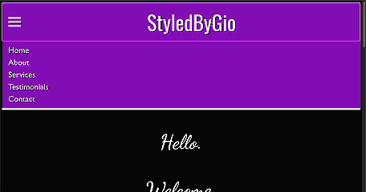
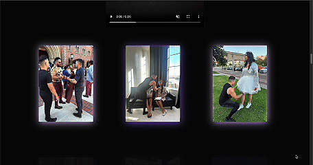

# Giovanny Collazo's Portfolio and Professional Styling Services Website

An application for a Professional Wardrobe Stylist

## Why I Built This

Giovanny Collazo, the brand owner of StyledByGio, is a Professional Stylist and Wardrobe Designer in the Greater Los Angeles area. Giovanny reached out to me and asked me to build him a portfolio website as he was preparing to expand his presence onto the Internet. His website will be used as a portfolio of his previously styled clients and as a lead generation tool to gain more clients through the Internet.

## Technologies Used

- React.js
- CSS3
- TypeScript
- Jest React Testing Library

## Visit the Website

Try the application live at [https://www.styledbygio.com]

## Features

- Users can book an appointment with Giovanny through an embedded Google Form on the Contact page
- Users can view a gallery of Giovanny's previously styled client's
- Users can reach out directly to Giovanny via href links leading to his Instagram, WhatApp, and Email
- Users can read about Giovanny's service offerings on the Services page

## Preview

### Form Preview

### Style Highlights Preview

